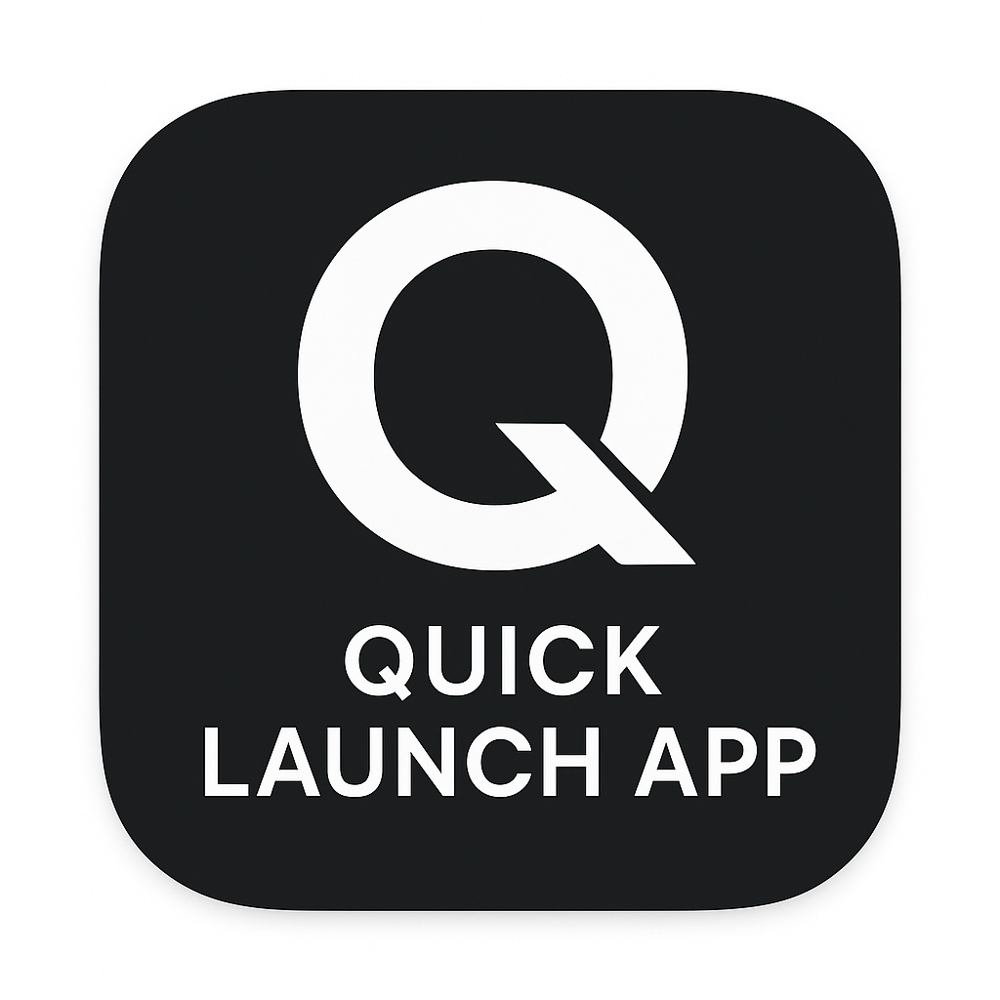
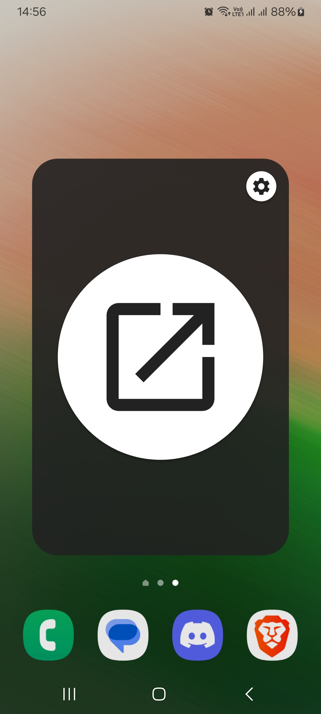
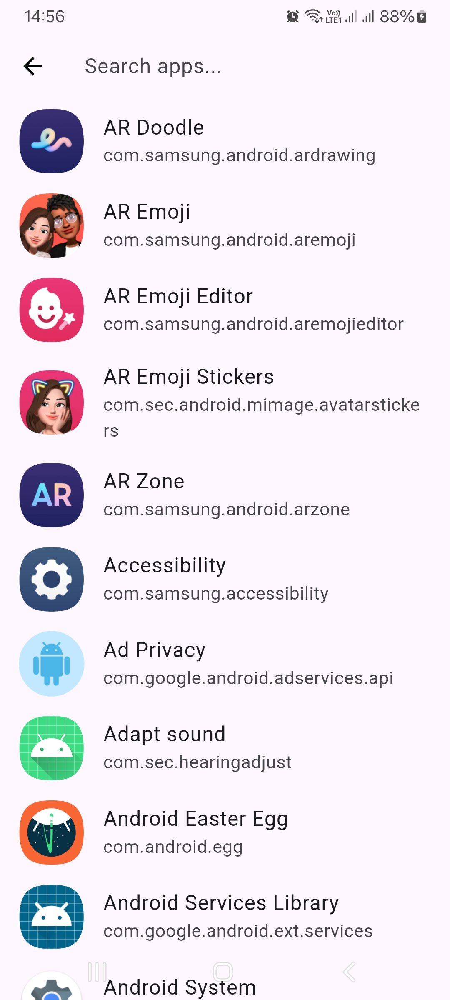

# Quick Launch App

A Flutter project for Android which lets you quickly launch applications and features and adjust sceren brightness with volume buttons.

## Features
- Select app or feature you want to launch and save preferences
- Minimal and fast
- Adjust screen brightness with a press of the volume buttons

## Requirements
- Android operating system with a minimum SDK/API level 34 (Android 14)

## Installation
Download and install the latest quicklaunchapp-release.apk. After that, it is recommended to set the side key of your device to open the Quick Launch app. Refer to your phone manufacturers manual for instructions. After that, you can use the side key to open the app.

## Images

